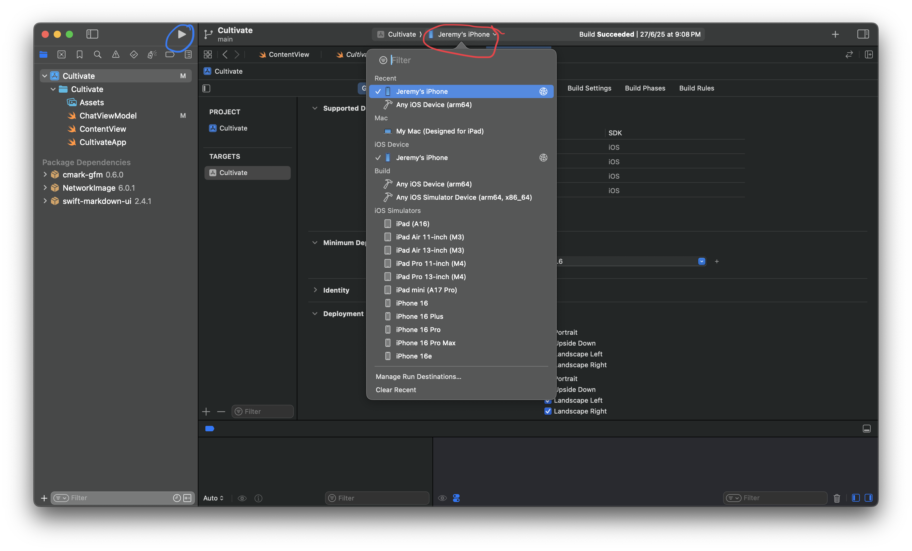

# Cultivate System #

The Cultivate system aimed to help users to find suitable companies or clients, that suits their needs and requirements. This system consists of 2 components: frontend and backend.

The frontend of this system uses iOS (and SwiftUI) to render the UI as well as sending requests to the server.

## Test Run


## Software Requirements ##
- iOS 15 or later / iPadOS 15 or later
- MacOS 12 or later
- Xcode 14 or later
- Python 3.8 or later

## Installation ##
1. Install Xcode on App Store and download this system's files through the *Releases* page in GitHub.
2. Once all downloads completed, go to the `Cultivate` folder and open `Cultivate.xcodeproj`. Then, change the cerificate with your own Bundle Identifier.
3. Go to `ChatViewModel` and change the IP address to your server's address (where you will host the Flask server). The code shoud looks like the following:
```swift
// MARK: Change the address of your server
guard let url = URL(string: "http://192.168.1.143:5000/server-request") else {
    messages.append(Message(text: "Failed to connect to server", isUser: false))
    return
    }
```

4. Go back to CultivateSystem folder and enter the following command into your Terminal.
```shell
cd CultivateBackend
python3 -m venv venv
pip install -r requirements.txt
```

5. Enter the following command to Terminal, and replace `YOUR_GEMINI` and `YOUR_SERP` to your own Gemini and SERP API keys.
```shell
export GEMINI_API_KEY=YOUR_GEMINI
export SERP_API_KEY=YOUR_SERP
```
If you don't want to input your API key everytime you activate the virtual environment, it would be nice to navigate to `venv/bin/activate` and add the command above to the end of the document. Don't forget to save it before you quit the document


6. Replace the last line of `main.py` to your server's IP address (where you run this Python file). The code should look like this:
```Python
if __name__ == '__main__':
    app.run(host='192.168.1.143', port=5000, debug=True)
```

7. To install the iOS app onto your device, connect your device to your Mac (cabled or under the same WiFi) and search for your device in the device list at the top of Xcode. Then, press the *Play* button to start the installation.



After installation of your app, you no longer need to reinstall again. (i.e. you can run the app without connecting to Xcode)


## Running this System
Before you run the system, please ensure you've activated the virtual environment (venv). If you haven't done so, please enter the following command into your Terminal.

```Shell
cd CultivateBackend
source venv/bin/activate
```

Once you've activated venv, you may run the following code to initalise your server.
```Shell
python main.py
```

You may now request the app to provide leads based on your requirements. 

Once you've finished running the app, please press *Control + C* (on Mac) to terminate the run of server. Then, run the following command in your terminal to deactivate the virtual environment.

```Shell
deactivate
```